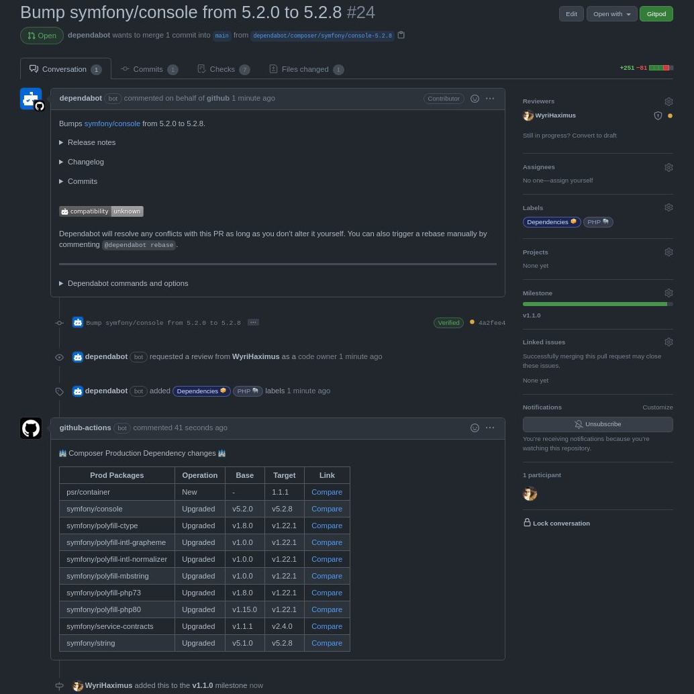

# github-action-composer.lock-diff

GitHub Action that diffs composer.lock between current branch and default branch



## Options (inputs)

This action supports the following option.

### dryRun

Whether to run this action in dry-run mode or not. Setting this to `yes` will prevent this action from commenting.

* *Required*: `No`
* *Type*: `string`
* *Example*: `yes`

## Output

This action has two outputs: the `production` and `development` outputs respective tables for each set of dependencies.

## Example

The following example comments on any PR, this example uses the `pull_request_target` trigger which gives it 
additional permissions. Be sure to read the [`documentation`](https://docs.github.com/en/actions/reference/events-that-trigger-workflows#pull_request_target) 
and this blog post on [`security`](https://securitylab.github.com/research/github-actions-preventing-pwn-requests/) for 
using this special trigger.

```yaml
name: Composer Diff
on:
  ## To make this workflow work in the simplest way possible, without a PAT or juggling information between, we need to
  ## run it with permissions as if it was already merged.
  ## Refs: https://docs.github.com/en/actions/reference/events-that-trigger-workflows#pull_request_target
  ## Refs: https://securitylab.github.com/research/github-actions-preventing-pwn-requests/
  ## Refs: https://twitter.com/WyriHaximus/status/1393679576828686340
  pull_request_target:
    types:
      - opened
      - synchronize
      - reopened
## This workflow needs the `pull-request` permissions to work
## Refs: https://docs.github.com/en/actions/reference/workflow-syntax-for-github-actions#permissions
permissions:
  pull-requests: write
jobs:
  comment-composer-lock-diff:
    name: Comment composer.lock diff
    runs-on: ubuntu-latest
    steps:
      ## Use v1 as it will do a full checkout, where v2 will only do a partial and not fetch all heads, two of which
      ## we need to create the diff between the PR's branch and the PR's target branch.
      - uses: actions/checkout@v1
      - name: Comment composer.lock diff
        uses: WyriHaximus/github-action-composer.lock-diff@v1
        env:
          GITHUB_TOKEN: ${{ secrets.GITHUB_TOKEN }}
```

## License ##

Copyright 2021 [Cees-Jan Kiewiet](http://wyrihaximus.net/)

Permission is hereby granted, free of charge, to any person
obtaining a copy of this software and associated documentation
files (the "Software"), to deal in the Software without
restriction, including without limitation the rights to use,
copy, modify, merge, publish, distribute, sublicense, and/or sell
copies of the Software, and to permit persons to whom the
Software is furnished to do so, subject to the following
conditions:

The above copyright notice and this permission notice shall be
included in all copies or substantial portions of the Software.

THE SOFTWARE IS PROVIDED "AS IS", WITHOUT WARRANTY OF ANY KIND,
EXPRESS OR IMPLIED, INCLUDING BUT NOT LIMITED TO THE WARRANTIES
OF MERCHANTABILITY, FITNESS FOR A PARTICULAR PURPOSE AND
NONINFRINGEMENT. IN NO EVENT SHALL THE AUTHORS OR COPYRIGHT
HOLDERS BE LIABLE FOR ANY CLAIM, DAMAGES OR OTHER LIABILITY,
WHETHER IN AN ACTION OF CONTRACT, TORT OR OTHERWISE, ARISING
FROM, OUT OF OR IN CONNECTION WITH THE SOFTWARE OR THE USE OR
OTHER DEALINGS IN THE SOFTWARE.
